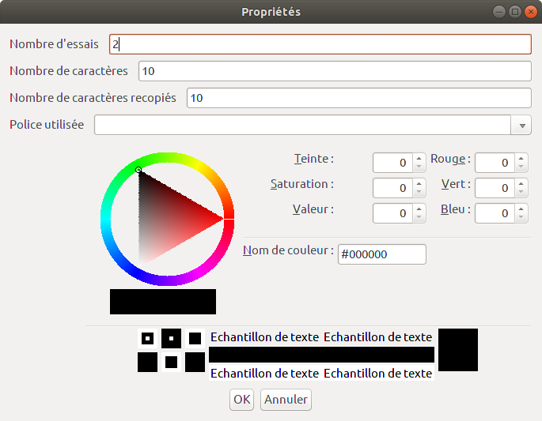

# Générateur de grilles d'écriture

Cette application est un outil pour aider à présenter les caractères chinois.

Il permet de générer :
* une grille d'écriture permettant de s'entrainer à écrire des caractères selon un modèle.
* une présentation d'un caractère sur une page entière.

Il est possible d'indiquer pour un caractère chinois :
* le caractère chinois,
* sa traduction,
* sa retranscription en pin yin,
* sa clef sémantique.

## Fenêtre des caractères

Cette fenêtre permet de définir les caractères à utiliser dans la grille de caractères, leur traduction, leur Pin Yin 
et leur clef sémantique.

Il est aussi possible d'indiquer un titre.
  
## Fenêtre de propriétés

Cette fenêtre permet d'indiquer le nombre de cractères à afficher dans la grille.
Le nombre de fois que l'on peut recopier chaque caractère pour la grille.
Il est possible de définir la police à utiliser et la couleur du texte.
 
## Fenêtre de présentation d'un caractère

Cette fenêtre affiche un aperçu de la page présentant un caractère sous forme d'une carte.
Il est possible d'imprimer le résultat ou de l'enregistrer en image. 

## Fenêtre de grille écriture

Cette fenêtre affiche un aperçu d'une grille d'écriture.
Il est possible d'imprimer le résultat ou de l'enregistrer en image. 
